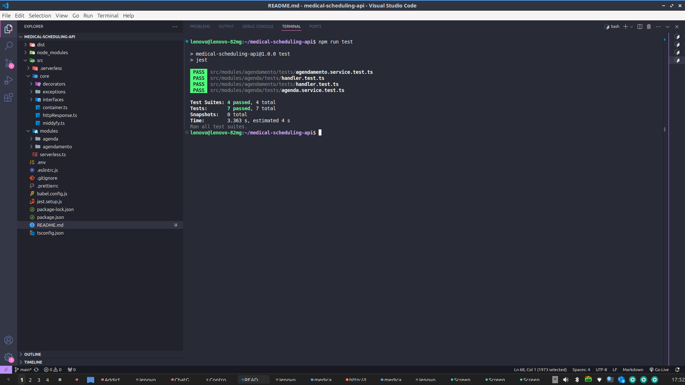

<h1 style="color: #16a085; border-bottom: 2px solid #3498db; padding-bottom: 10px;">Projeto de Agendamento Serverless</h1>

Este projeto é uma aplicação serverless para gerenciamento de agendamentos, utilizando AWS Lambda, TypeScript e o Serverless Framework.

<h2 style="color: #16a085;">📁 Estrutura do Projeto</h2>

<h3 style="color: #16a085;"><code>src/</code> (Código Fonte Principal)</h3>

Esta é a pasta central do projeto onde está concentrado toda as outras referente a logica de controladores, serviços e testes.

<h4 style="color: #27ae60;"><code>handlers/</code> (Controladores de Requisições)</h4>
<ul style="list-style-type: square; padding-left: 20px;">
  <li><strong style="color: #e74c3c;">createAgendamento.ts</strong>: Responsável por lidar com as requisições de criação de novos agendamentos. Processa os dados recebidos via <code>POST /agendamento</code> e orquestra a lógica para registrar o agendamento.</li>
  <li><strong style="color: #e74c3c;">getAgendamentos.ts</strong>: Encapsula a lógica para buscar e retornar agendamentos existentes. Responde às requisições <code>GET /agendas</code>, fornecendo uma lista dos agendamentos.</li>
</ul>

<h3 style="color: #16a085;"><code>tests/</code> (Testes da Aplicação)</h3>

Pasta dedicada à validação e garantia da qualidade do código.

<h4 style="color: #27ae60;"><code>tests/</code> (Testes de Integração)</h4>
<ul style="list-style-type: square; padding-left: 20px;">
  <li><strong style="color: #e74c3c;">agendamento.test.ts</strong>: Contém testes para os endpoints relacionados a agendamentos. Verifica se a integração entre diferentes partes do sistema funciona corretamente.</li>
</ul>

<h2 style="color: #2980b9;">⚙️ Arquivos de Configuração e Documentação</h2>

<ul style="list-style-type: square; padding-left: 20px;">
  <li><strong style="color: #e74c3c;">serverless.ts</strong>: Arquivo de configuração do Serverless Framework. Define as funções serverless, os eventos que as disparam e os recursos da AWS necessários.</li>
  <li><strong style="color: #e74c3c;">.env</strong>: Arquivo de exemplo para variáveis de ambiente. caso precise definir as credenciais da AWS coloque a key aqui com as credenciais validas<code>.env</code>.</li>
  <li><strong style="color: #e74c3c;">README.md</strong>: Documentação principal do projeto.</li>
</ul>

<h2 style="color: #2980b9;">🚀 Como rodar o projeto</h2>

<ol style="padding-left: 20px;">
  <li>Instale as dependências:
    <pre style="background-color: #2c3e50; color: #ecf0f1; padding: 10px; border-radius: 5px;"><code>npm install</code></pre>
  </li>
  
  <li>Executar em modo desenvolvimento
    <pre style="background-color: #2c3e50; color: #ecf0f1; padding: 10px; border-radius: 5px;"><code>npm run dev</code></pre>
  </li>
</ol>

<h3 style="color: #27ae60;">Rodando Localmente na Maquina!</h3>

  

<ol start="3" style="padding-left: 20px;">
  <li>Executar testes</li>
</ol>

<h3 style="color: #27ae60;">Testes com Jest!</h3>

  

<ul style="list-style-type: square; padding-left: 20px;">
  <li>Executar a suit de testes da aplicação.</li>
</ul>

<pre style="background-color: #2c3e50; color: #ecf0f1; padding: 10px; border-radius: 5px;"><code>npm run test</code></pre>

<ol start="4" style="padding-left: 20px;">
  <li>Executar o deploy para AWS</li>
</ol>

<ul style="list-style-type: square; padding-left: 20px;">
  <li>Necessário trocar as credenciais no .env KEY e IAM da Amazon validos após isso acessar o endpoint disponível para executar via postman.</li>
</ul>

<pre style="background-color: #2c3e50; color: #ecf0f1; padding: 10px; border-radius: 5px;"><code>npm run deploy</code></pre>

<h2 style="color: #2980b9;">Processo de desenvolvimento</h2>

Deixarei aqui algumas imagens registradas com o Postman retornando os dados mocks do desafio.

<h3 style="color: #27ae60;">Agendamentos POSTMAN (GET)</h3>

  

<h3 style="color: #27ae60;">Agendamento POSTMAN (POST)</h3>

  

<h2 style="color: #2980b9;">📋 Exemplo de Payload para POST /agendamento</h2>

<h3 style="color: #27ae60;">Requisição JSON</h3>

<pre style="background-color: #282c34; color: #abb2bf; padding: 15px; border-radius: 5px; overflow-x: auto;">
<code>{
  "agendamento": {
    "medico": "Dr. João Silva",
    "paciente": "Carlos Almeida",
    "data_horario": "2024-10-05 09:00"
  }
}</code></pre>

<h3 style="color: #27ae60; margin-top: 20px;">Resposta Esperada</h3>

<pre style="background-color: #282c34; color: #abb2bf; padding: 15px; border-radius: 5px; overflow-x: auto;">
<code>{
  "mensagem": "Agendamento realizado com sucesso",
  "agendamento": {
    "medico": "Dr. João Silva",
    "paciente": "Carlos Almeida",
    "data_horario": "2024-10-05 09:00"
  }
}</code></pre>

